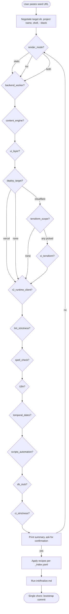

# Bootstrap flowchart

Human-facing audit of the interview tree. The agent treats `questions.yaml` as
the source of truth — this diagram just helps you see the shape.

Skipped questions (when `depends_on` is unmet) collapse silently — the agent
moves to the next. There is no fallback path or "back" button; if the user
wants to change an earlier answer, they restart the interview.
